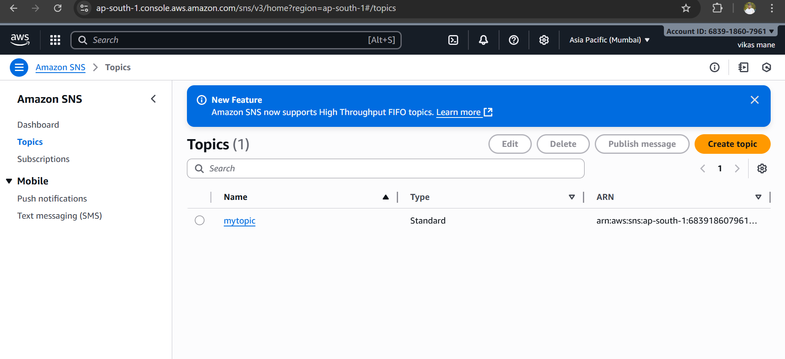
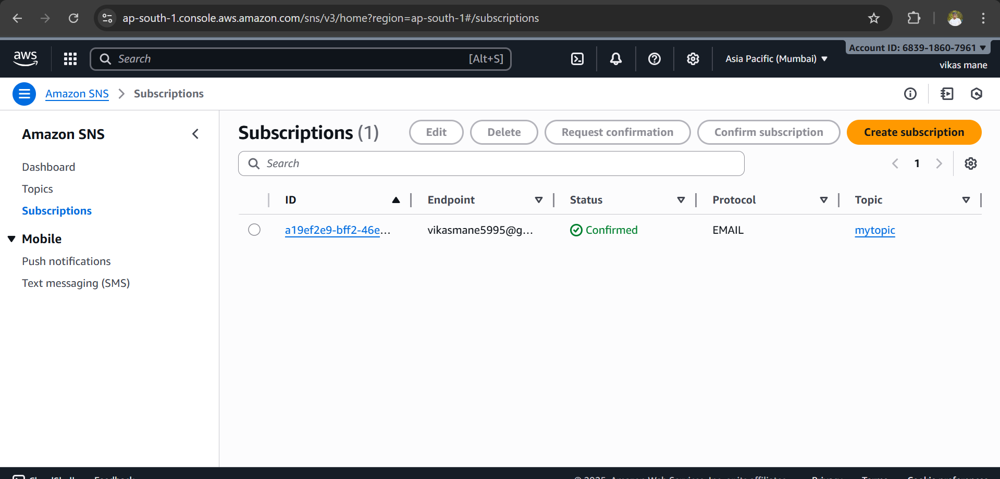
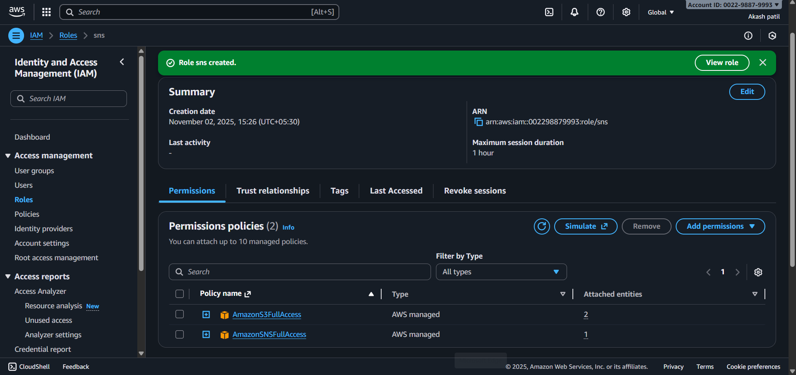

# AWS-Lambda-Serverless-Function 

* #  Overview
   This project demonstrates a **Serverless Application** using **AWS Lambda**, **Amazon S3**, **Amazon SNS**, and **IAM Policies**.  
The goal of this project is to automate a workflow where:
  1. A file is uploaded to an **S3 bucket**.
  2. This event **triggers a Lambda function**.
  3. The Lambda function processes the event and sends a **notification message to an SNS topic**.
  4. The SNS topic then sends notifications (email/SMS) to all subscribed users.

This architecture showcases the **event-driven serverless approach** on AWS - scalable, cost-effective, and easy to maintain.

* ## AWS Services Used
 * ### AWS Lambda 
   * AWS LambdaA serverless compute service that runs backend code in response to events.  
   * In this project, Lambda is triggered automatically when a file is uploaded to S3.

* ### Serverless Architecture
  * No need to manage servers or infrastructure.  
  * AWS automatically scales and executes your code in response to events.
* ### Automatic Scaling
  * Lambda scales your application automatically by running code in parallel in response to incoming events.
* ### Pay-as-you-go  
  * You only pay for the compute time your code actually uses (measured in milliseconds).
* ### Supports Multiple Languages
  * Supported runtimes: Python, Node.js, Java, Go, C#, Ruby and more.
* ### Integrated with AWS Services

  * Works seamlessly with S3, SNS, DynamoDB, API Gateway, CloudWatch, and many others.  
* ### Monitoring

  * Automatically logs metrics and output to Amazon CloudWatch for performance tracking and debugging.
* ### Screenshot :

 

 * ### Amazon S3 (Simple Storage Service)

   *  Used for storing files and triggering the Lambda function.  
   * Whenever a file is uploaded to the bucket, an event notification is sent to invoke Lambda.
* ### Scalability
  * S3 automatically scales to store any amount of data — from a few kilobytes to petabytes.
* ### Durability
  *  Data is redundantly stored across multiple facilities, offering 99.999999999% (11 nines) durability
* ### Availability
   * Designed for 99.99% availability — ensuring your data is always accessible.
* ### Security
  * Integrated with AWS IAM for access control.  
  * Supports encryption (both at rest and in transit).  
  * Allows defining bucket policies and ACLs (Access Control Lists) to control who can access your data.
* ### Cost-Effective
  * Pay only for the storage you actually use.  
  * Offers different storage classes for cost optimization. 
* ### Event Notifications 
   * You can configure S3 to send events (like file uploads) to AWS Lambda, SNS, or SQS, enabling automated workflows

* ### Amazon SNS (Simple Notification Service)

  * Used to send automated notifications after Lambda processes the file.  
  * Subscribers can receive messages via Email, SMS, or HTTP endpoints.
* ### Fully Managed Service  
   * No servers to manage; AWS handles all infrastructure.
* ### High Throughput and Scalability   
  *  Delivers millions of messages per second to multiple subscribers.
* ### Multi-Protocol Support  
  * Supports various message delivery protocols:

   * HTTP/S

  * Email/Email-JSON

  * SMS

  * Lambda

  * SQS

  * Mobile push (APNS, GCM, etc.)
* ### Reliability and Durability

  * Messages are stored redundantly across multiple servers and data centers.  
* ### Security

  * Integrated with AWS IAM for access control.  
  * Supports encryption (SSE-KMS) for secure message storage.  
  * Offers access policies and signature verification.  
* ### Message Filtering

  * Subscribers can filter messages based on attributes — so they receive only relevant notifications
* ### Cost-Effective

  * Pay only for the number of messages published and delivered.  
* ### Screenshot :

* ### AWS IAM (Identity and Access Management)
  * IAM roles and policies are used to securely grant Lambda access to S3, SNS, and CloudWatch logs.

* #### User Management
  * You can create individual IAM Users for people who need access to AWS    
  * Each user can have their own credentials (password, access keys).

* #### Roles
  * IAM Roles are temporary access identities used by AWS services or applications.

  * For example:  
  * An EC2 instance can assume a role to access S3.   
  * A Lambda function can assume a role to publish messages to SNS.

* #### Policies  
  * Policies are JSON documents that define permissions (allow or deny).  
  * Example: A policy allowing access to S3 and SNS.

 * ### Sereenshot

   
   

* ### Benefits of This Serverless Approach
  * No server management: AWS handles scaling and infrastructure.  
  * Event-driven: Automatically triggers based on user uploads.  
  * Cost-effective: Pay only for the execution time.  
  * Highly scalable: Handles any number of concurrent uploads.  
  * Integrated AWS security: IAM roles control resource access.
  
  
* ### Conclusion

  * This project demonstrates how to integrate AWS S3, Lambda, SNS, and IAM to build an automated, event-driven workflow.
  * Such serverless architectures are widely used for:  
  * Real-time file processing  
  * Notification systems  
  * Automated workflows  
  * Cloud-based event handling

  * #### By leveraging AWS managed services, the solution is scalable, reliable, and low-cost, making it ideal for production as well as academic projects.